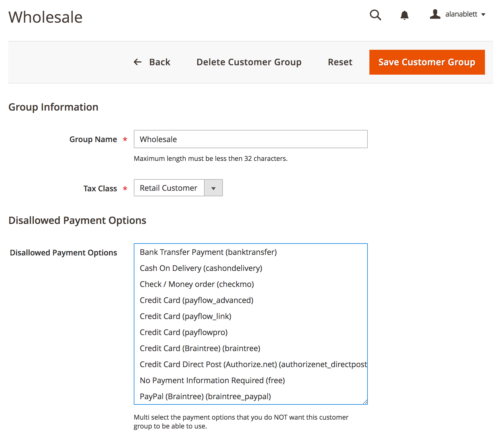

# Galactic Labs - Customer Group Payment Filters

This simple module adds a new section to the Customer Groups admin page, allowing you to define payment options that ***should not*** be allowed for the chosen customer group.

***Note: These settings will affect both frontend and backend orders.***

## Installation

Require the module

```bash
composer require galacticlabs/customer-group-payment-filters
```

Enable the module

```bash
php bin/magento module:enable GalacticLabs_CustomerGroupPaymentFilters
```

Run setup to install module and set up table(s)

```bash
php bin/magento setup:upgrade
```

## Usage

Once installed, you can choose which payment methods should be restricted by going to `Stores > Other Settings > Customer groups` and selecting the group you would like to place restrictions on.

The edit screen has a new section called Disallowed Payment Options. This contains a multiselect list of the payment options in the Magento system. Choose the ones you'd like to disable for the customer group, then save for changes to take effect. These options are also available when creating a new customer group.

***Note: These options will not affect anything if the chosen payment options are themselves not enabled.***



## Bugs/Feature Requests & Contribution

Please do open a pull request on GitHub should you want to contribute, or create an issue.

## Todo

I plan on cleaning this up a bit and also adding some tests to prove functional correctness. I'd also be interested in discussions on how I could have achieve the same results using alternative/better techniques. I don't like the fact i'm accessing the request object inside the repository save method. Is it possible to perform this action in the admin controller instead? Unfortunately I hit an issue when saving a new customer group in that I couldn't access the ID of the new group in the same request. I'm sure with more time I would of figured it but this was created very quickly.

* Caching should be added

## License
[MIT](https://opensource.org/licenses/MIT) - Do as you wish 👍